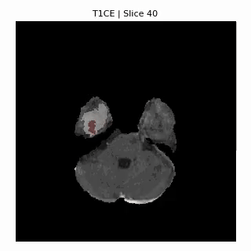

# 3D MRI Brain Tumor Segmentation & Visualization

<div align="center">

[](https://www.python.org/) [](https://tensorflow.org/) [](LICENSE) [](https://github.com/TomSchimansky/CustomTkinter)

</div>

A modern GUI application for 3D MRI brain tumor segmentation using a U-Net deep learning model. This tool provides an intuitive interface for medical professionals and researchers to load, visualize, and analyze brain tumor patterns from NIfTI MRI scans.


## Table of Contents

- [Features](#features)
- [Model Architecture](#model-architecture)
- [NIfTI MRI Modalities Explained](#nifti-mri-modalities-explained)
- [Getting Started](#getting-started)
  - [Prerequisites](#prerequisites)
  - [Installation](#installation)
- [Usage](#usage)
- [Project Structure](#project-structure)
- [GPU Setup Guide](#gpu-setup-guide)
- [Contributing](#contributing)
- [License](#license)
- [Acknowledgments](#acknowledgments)
- [Medical Disclaimer](#️-medical-disclaimer)

## Features

- **Multi-Sequence MRI Support**: Load and process FLAIR and T1CE NIfTI images.
- **AI-Powered Segmentation**: Utilizes a trained 3D U-Net model for real-time tumor segmentation.
- **Interactive 3D Visualization**: Smoothly navigate through MRI slices with an intuitive slider.
- **Multi-Class Tumor Display**: Clearly visualizes different tumor regions:
  - **Necrotic/Core**: Non-enhancing tumor core (Red)
  - **Edema**: Peritumoral edema (Yellow)
  - **Enhancing Tumor**: Gadolinium-enhancing tumor (Green)
- **Modern & Clean UI**: A user-friendly, dark-themed interface built with CustomTkinter.

<p align="center">
  
</p>

- **Modular & Extensible**: Well-organized codebase for easy maintenance and future development.

## Model Architecture

The application employs a **3D U-Net**, a state-of-the-art deep convolutional neural network architecture optimized for biomedical image segmentation.

- **Input**: Dual-channel 3D MRI volumes (FLAIR + T1CE sequences).
- **Output**: 4-class segmentation mask (Background, Necrotic/Core, Edema, Enhancing).
- **Training Data**: The model was trained on the [BraTS 2020 dataset](https://www.kaggle.com/datasets/awsaf49/brats20-dataset-training-validation).
- **Preprocessing**: Input images are automatically resized and normalized before being fed to the model.

## NIfTI MRI Modalities Explained

MRI brain tumor datasets typically include several types of 3D NIfTI files, each capturing different tissue contrasts and tumor characteristics. The main modalities are:

- **T1**: Standard anatomical scan, useful for general brain structure.
- **T1CE**: T1-weighted with contrast enhancement (Gadolinium), highlights active tumor regions.
- **T2**: Sensitive to fluid content, helps visualize edema and tumor boundaries.
- **FLAIR**: Suppresses fluid signals, making lesions and edema more visible.
- **Segmentation**: Ground truth mask labeling tumor subregions (multi-class).

These modalities are stored as `.nii` or `.nii.gz` files, each representing a 3D volume.

**Visualization Example:**

Below are sample slices from each modality and their overlay:

<p align="center">
  
</p>

Animated comparison:

<p align="center">
  
</p>

Combined segmentation example for a single patient:

<p align="center">
  
</p>

These visualizations help understand how each modality contributes to tumor detection and segmentation.

## Getting Started

### Prerequisites

- **Python**: 3.8 or higher
- **OS**: Windows, macOS, or Linux
- **RAM**: 8GB minimum, 16GB recommended for handling large datasets.
- **GPU (Optional but Recommended)**: An NVIDIA GPU with CUDA support for significantly faster predictions.

### Installation

1.  **Clone the repository:**
    ```bash
    git clone https://github.com/Lordiod/3d-mri-brain-tumor-segmentation.git
    cd 3d-mri-brain-tumor-segmentation
    ```

2.  **Create and activate a virtual environment:**
    ```bash
    # For Windows
    python -m venv venv
    .\venv\Scripts\activate

    # For macOS/Linux
    python3 -m venv venv
    source venv/bin/activate
    ```

3.  **Install the required dependencies:**
    ```bash
    pip install -r requirements.txt
    ```

4.  **Download a Pre-trained Model:**
    A trained model is required to run the application. Place a compatible pre-trained Keras model file named `model_x1_1.h5`.
    *(Note: A placeholder file `model_placeholder.txt` is provided with instructions on where to acquire a model if one is not included).)*

## Usage

1.  **Launch the application:**
    ```bash
    python main.py
    ```

2.  **Load MRI Images:**
    - Click **"Load FLAIR Image"** to select a FLAIR NIfTI file (`.nii` or `.nii.gz`).
    - Click **"Load T1CE Image"** to select a corresponding T1CE NIfTI file.
    - Both image sequences are required for the model to perform an accurate segmentation.

3.  **Generate Segmentation:**
    - After loading both images, click **"Predict Segmentation"**.
    - The model will process the data, and the segmentation results will appear in the display panels. Processing time may vary based on your hardware.

<p align="center">
  
</p>

4.  **Explore the Results:**
    - Use the **slice slider** at the bottom to navigate through the axial slices of the 3D MRI volume.
    - The 6-panel display shows the original images, the combined segmentation overlay, and the individual masks for each tumor class.

## Project Structure

```
.
├── main.py                    # Main application entry point
├── requirements.txt           # Python dependencies for CPU
├── requirements-gpu.txt       # Python dependencies for GPU
├── models/
│   ├── brain_tumor_model.py   # Handles model loading and prediction
│   └── brain_tumor_model.h5   # Pre-trained Keras model (to be added)
├── ui/
│   ├── main_window.py         # Defines the main GUI layout and logic
│   └── visualization_window.py# Manages the 6-panel display
├── utils/
│   ├── config.py              # Application configuration and constants
│   └── data_handler.py        # Utilities for loading and processing NIfTI files
├── building the model/        # Resources for training your own model
│   └── 3d-mri-brain-tumor-segmentation-u-net.ipynb
└── public/
    └── app.gif                # Animated GIF for the README
```

## GPU Setup Guide

<details>
<summary>Click to expand the detailed GPU setup guide for model training and accelerated inference.</summary>

Training the U-Net model or running inference with GPU acceleration requires a specific environment setup. An NVIDIA GPU is **essential** for training in a reasonable timeframe.

### Requirements for GPU Support

- **GPU**: NVIDIA GPU with 8GB+ VRAM (RTX 30-series or newer recommended).
- **CUDA Toolkit**: Version 11.2 (for TensorFlow 2.10).
- **cuDNN**: Version 8.1 (for CUDA 11.2).

### Setup Steps (Windows)

1.  **Install NVIDIA Drivers**: Ensure you have the latest NVIDIA drivers for your GPU.
2.  **Install CUDA Toolkit 11.2**:
    - Download from the [NVIDIA archive](https://developer.nvidia.com/cuda-11.2.2-download-archive).
    - Select: `Windows` > `x86_64` > `10` > `exe (local)`.
    - Run the installer. A custom installation allows you to select only the components you need.
3.  **Install cuDNN v8.1 for CUDA 11.2**:
    - An NVIDIA Developer account is required.
    - Download from the [cuDNN archive](https://developer.nvidia.com/rdp/cudnn-archive).
    - Extract the downloaded ZIP file.
    - Copy the contents of the extracted folders into the CUDA installation directory (typically `C:\Program Files\NVIDIA GPU Computing Toolkit\CUDA\v11.2`):
      - `bin\*.dll` -> `CUDA\v11.2\bin`
      - `include\*.h` -> `CUDA\v11.2\include`
      - `lib\x64\*.lib` -> `CUDA\v11.2\lib\x64`
4.  **Install GPU Dependencies**:
    - Use the `requirements-gpu.txt` file to install TensorFlow with GPU support and other libraries.
    ```bash
    pip install -r requirements-gpu.txt
    ```
5.  **Verify Installation**:
    - Run this command to check if TensorFlow can detect your GPU.
    ```python
    import tensorflow as tf
    print("GPU Available: ", tf.config.list_physical_devices('GPU'))
    ```

### Using Conda (Alternative)

Conda can simplify the management of CUDA and cuDNN versions.

```bash
conda create -n brain-tumor-gpu python=3.9
conda activate brain-tumor-gpu
conda install -c conda-forge cudatoolkit=11.2 cudnn=8.1.0
pip install -r requirements-gpu.txt
python -c "import tensorflow as tf; print('GPU Available:', tf.config.list_physical_devices('GPU'))"
```

</details>

## Contributing

Contributions are welcome! If you would like to contribute to this project, please fork the repository and submit a pull request. For major changes, please open an issue first to discuss what you would like to change.

1.  Fork the Project
2.  Create your Feature Branch (`git checkout -b feature/AmazingFeature`)
3.  Commit your Changes (`git commit -m 'Add some AmazingFeature'`)
4.  Push to the Branch (`git push origin feature/AmazingFeature`)
5.  Open a Pull Request

## License

This project is licensed under the MIT License. See the [LICENSE](LICENSE) file for more details.

## Acknowledgments

- The **BraTS Challenge** organizers for providing the dataset.
- The developers of **TensorFlow**, **CustomTkinter**, and **NiBabel**.
- The open-source community for advancing medical imaging AI.

## ⚠️ Medical Disclaimer

This software is intended for **research and educational purposes only**. It is **not a medical device** and should not be used for clinical diagnosis, treatment decisions, or any other medical application. Always consult with a qualified medical professional for diagnosis and treatment.
